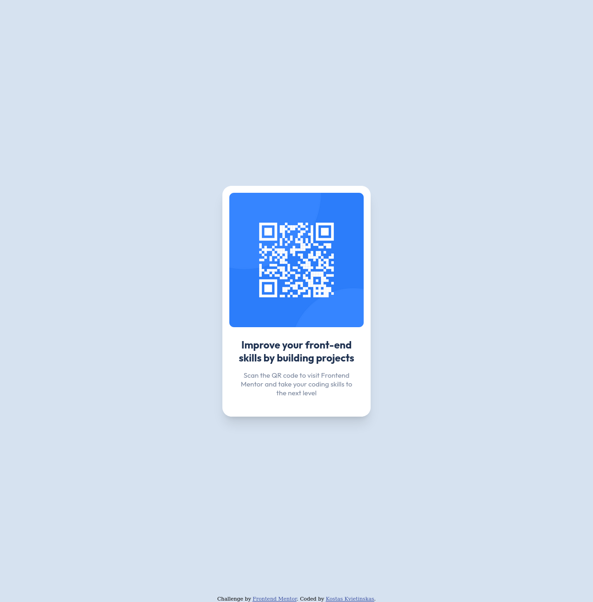

# Frontend Mentor - QR code component solution

This is a solution to the [QR code component challenge on Frontend Mentor](https://www.frontendmentor.io/challenges/qr-code-component-iux_sIO_H). Frontend Mentor challenges help you improve your coding skills by building realistic projects.

## Table of contents

- [Overview](#overview)
  - [Screenshot](#screenshot)
  - [Links](#links)
- [My process](#my-process)
  - [Built with](#built-with)
  - [What I learned](#what-i-learned)
  - [Continued development](#continued-development)
  - [Useful resources](#useful-resources)
- [Author](#author)

## Overview

### Screenshot

### Links

<!-- - Solution URL: [Add solution URL here](https://kostaskv-qr-code-component.netlify.app/) -->

- Live Site URL: [https://kostaskv-qr-code-component.netlify.app/](https://kostaskv-qr-code-component.netlify.app/)

## My process

### Built with

- HTML
- CSS

### What I learned

- How to quickly deploy a site using Netlify
- Centering a div vertically by using a flexbox as a wrapper

### Continued development

Going forward, I want to:

- Work more on understanding positioning in CSS (e.g., different ways to centre a div).
- Reconstruct this component using Tailwind CSS

### Useful resources

- [Tailwind CSS box shadow utilities](https://tailwindcss.com/docs/box-shadow) - Even though this solution does not use Tailwind CSS, their document page for box shadows helped me to save time and implement a decent looking one very quickly.
- [Centre a Div Vertically Using CSS](https://www.delftstack.com/howto/css/center-a-div-vertically/#use-the-css-flexbox-to-vertically-center-the-div-in-css) - Short easy-to-read example code showing a quick trick to centre content vertically on the page (by wrapping it all in a flexbox).

## Author

- Website - [Kostas Kvietinskas](https://www.kostask.com)
- Frontend Mentor - [@KostasKv](https://www.frontendmentor.io/profile/kostaskv)
